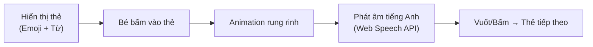
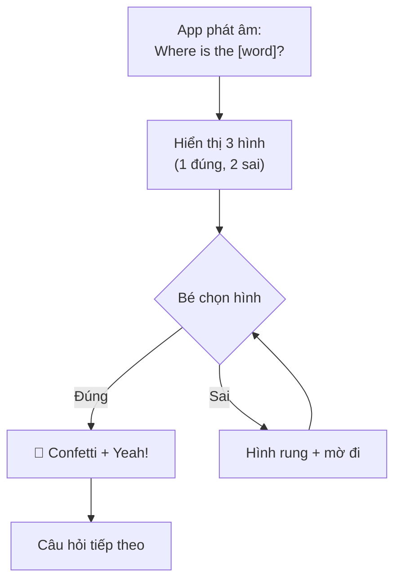
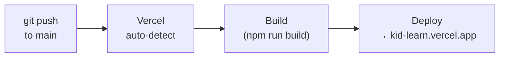

# 📘 PRD — KidLearn: Ứng dụng Học Tiếng Anh cho Trẻ Em

> **Version:** 1.0  
> **Ngày tạo:** 2026-02-10  
> **Tác giả:** Steve (via Antigravity)  
> **Trạng thái:** Draft

---

## 1. Tổng quan sản phẩm (Product Overview)

**KidLearn** là ứng dụng web giúp trẻ em (3–6 tuổi) học từ vựng tiếng Anh thông qua hai chế độ tương tác: **Flashcard** (Học) và **"Where is…?" Quiz** (Chơi). Ứng dụng được xây dựng trên nền tảng React + Vite, tối ưu cho thiết bị di động, và triển khai miễn phí trên Vercel.

### Tầm nhìn (Vision)

Tạo ra một công cụ học tiếng Anh **miễn phí, mã nguồn mở**, đơn giản đến mức bất kỳ phụ huynh nào cũng có thể tùy chỉnh nội dung cho con mình chỉ bằng cách sửa một file JSON duy nhất.

---

## 2. Đối tượng người dùng (Target Users)

| Persona                      | Mô tả                           | Nhu cầu chính                                                          |
| ---------------------------- | ------------------------------- | ---------------------------------------------------------------------- |
| 👶 **Trẻ em (3–6 tuổi)**     | Người dùng chính, chưa biết đọc | Giao diện trực quan, hình ảnh lớn, âm thanh rõ ràng, phản hồi vui nhộn |
| 👨‍👩‍👧 **Phụ huynh**             | Người thiết lập và giám sát     | Dễ cài đặt, dễ tùy chỉnh nội dung, không quảng cáo                     |
| 👩‍💻 **Cộng đồng Open-source** | Nhà phát triển đóng góp         | Codebase sạch, dễ fork, dễ mở rộng                                     |

---

## 3. Phạm vi sản phẩm (Scope)

### 3.1 Trong phạm vi (In Scope) — MVP

- ✅ Bộ từ vựng 100 từ, chia theo 7 chủ đề
- ✅ Chế độ Flashcard (học từ vựng)
- ✅ Chế độ Quiz "Where is…?" (trò chơi tìm hình)
- ✅ Phát âm tiếng Anh tự động (Web Speech API)
- ✅ Hiệu ứng chúc mừng (confetti, animation)
- ✅ Responsive — tối ưu cho mobile & tablet
- ✅ Triển khai trên Vercel

### 3.2 Ngoài phạm vi (Out of Scope) — Tương lai

- ❌ Hệ thống đăng nhập / tài khoản người dùng
- ❌ Theo dõi tiến trình học (Progress Tracking)
- ❌ Quản lý nhiều bộ từ vựng
- ❌ Backend / Database
- ❌ Ứng dụng native (iOS/Android)

---

## 4. Tính năng chi tiết (Feature Specifications)

### 4.1 Dữ liệu từ vựng

| Thuộc tính             | Chi tiết                                                                                                         |
| ---------------------- | ---------------------------------------------------------------------------------------------------------------- |
| **Tổng số từ**         | 100 từ                                                                                                           |
| **Chủ đề**             | Động vật (20), Trái cây (20), Màu sắc (10), Hình khối (10), Phương tiện (10), Cơ thể (10), Đồ vật trong nhà (20) |
| **Nguồn dữ liệu**      | File `vocabulary.json` duy nhất                                                                                  |
| **Hình ảnh**           | Emoji lớn hoặc Icon màu (nhẹ, load nhanh, phù hợp trẻ 3 tuổi)                                                    |
| **Khả năng tùy chỉnh** | Người dùng chỉ cần sửa file JSON → app tự cập nhật                                                               |

**Cấu trúc JSON mẫu:**

```json
{
  "category": "animals",
  "words": [
    {
      "en": "elephant",
      "vi": "con voi",
      "emoji": "🐘"
    }
  ]
}
```

---

### 4.2 Chế độ Flashcard (Học)



| Yêu cầu        | Chi tiết                                     |
| -------------- | -------------------------------------------- |
| **Giao diện**  | Một slide lớn giữa màn hình                  |
| **Tương tác**  | Bấm vào hình → Animation rung rinh → Phát âm |
| **Điều hướng** | Vuốt trái/phải hoặc nút mũi tên              |
| **Phát âm**    | Web Speech API, `lang="en-US"`, `rate=0.9`   |

---

### 4.3 Chế độ Quiz — "Where is…?"



| Yêu cầu          | Chi tiết                                                 |
| ---------------- | -------------------------------------------------------- |
| **Câu hỏi**      | Phát âm "Where is the [word]?"                           |
| **Lựa chọn**     | 3 hình ngẫu nhiên (1 đúng, 2 sai — cùng chủ đề ưu tiên)  |
| **Trả lời đúng** | Hiệu ứng `canvas-confetti` + âm thanh "Yeah!"            |
| **Trả lời sai**  | Hình rung nhẹ (shake) + mờ đi, cho chọn lại đến khi đúng |

---

## 5. Yêu cầu kỹ thuật (Technical Requirements)

### 5.1 Tech Stack

| Thành phần     | Công nghệ                         |
| -------------- | --------------------------------- |
| **Framework**  | React 18+ với TypeScript          |
| **Build Tool** | Vite                              |
| **Animation**  | Framer Motion                     |
| **Icons**      | Lucide React + Emoji              |
| **Hiệu ứng**   | canvas-confetti                   |
| **Phát âm**    | Web Speech API (built-in browser) |
| **Hosting**    | Vercel (auto-deploy từ GitHub)    |

### 5.2 Cấu trúc dự án

```text
kid-learn-app/
├── src/
│   ├── data/
│   │   └── vocabulary.json       ← Bộ 100 từ vựng
│   ├── components/
│   │   ├── Card.tsx              ← Component hiển thị thẻ
│   │   ├── FlashcardMode.tsx     ← Logic chế độ Flashcard
│   │   └── QuizMode.tsx          ← Logic chế độ Quiz
│   ├── App.tsx                   ← Điều hướng chính
│   └── main.tsx                  ← Entry point
├── public/                       ← Assets tĩnh (âm thanh)
└── package.json
```

### 5.3 Yêu cầu hiệu năng

| Metric                     | Mục tiêu            |
| -------------------------- | ------------------- |
| **First Contentful Paint** | < 1.5s              |
| **Bundle Size**            | < 200KB (gzip)      |
| **Lighthouse Score**       | > 90 (Performance)  |
| **Offline**                | Không yêu cầu (MVP) |

---

## 6. Yêu cầu UX/UI (Design Requirements)

### 6.1 Nguyên tắc thiết kế

1. **Kid-friendly** — Màu sắc tươi sáng, góc bo tròn, font chữ lớn
2. **Touch-first** — Vùng chạm lớn (tối thiểu 48×48px), hỗ trợ vuốt
3. **Phản hồi tức thì** — Mọi tương tác đều có animation/âm thanh
4. **Không gây nản** — Trả lời sai không bị trừ điểm, chỉ thử lại

### 6.2 Layout chính

```
┌─────────────────────────────┐
│  🏠 KidLearn     [📖] [🎮]  │  ← Header + Mode Switch
├─────────────────────────────┤
│                             │
│                             │
│        [ 🐘 ]               │  ← Nội dung chính
│      "Elephant"             │     (Flashcard hoặc Quiz)
│                             │
│                             │
├─────────────────────────────┤
│       ◀   ● ● ● ●   ▶     │  ← Navigation dots
└─────────────────────────────┘
```

### 6.3 Bảng màu đề xuất

| Mục đích  | Màu             | Hex       |
| --------- | --------------- | --------- |
| Nền chính | Vàng nhạt ấm    | `#FFF9E6` |
| Nút chính | Xanh dương tươi | `#4ECDC4` |
| Accent    | Cam san hô      | `#FF6B6B` |
| Đúng      | Xanh lá         | `#2ECC71` |
| Sai       | Đỏ nhẹ          | `#E74C3C` |

---

## 7. Triển khai & Vận hành (Deployment)

### 7.1 Quy trình CI/CD



### 7.2 Các bước triển khai

1. Push code lên GitHub repository
2. Kết nối repository với Vercel
3. Vercel tự động build & deploy
4. Mỗi lần `git push` → trang web tự động cập nhật

---

## 8. Tiêu chí chấp nhận (Acceptance Criteria)

### Chế độ Flashcard

- [ ] Hiển thị đầy đủ 100 từ vựng theo chủ đề
- [ ] Bấm vào thẻ → animation rung rinh
- [ ] Phát âm tiếng Anh chuẩn (Web Speech API)
- [ ] Điều hướng giữa các thẻ (vuốt hoặc nút bấm)

### Chế độ Quiz

- [ ] Phát câu hỏi "Where is the [word]?"
- [ ] Hiển thị 3 lựa chọn (1 đúng, 2 sai)
- [ ] Đúng → confetti + âm thanh chúc mừng
- [ ] Sai → shake + mờ đi, cho chọn lại

### Kỹ thuật

- [ ] Build thành công với Vite
- [ ] Deploy thành công trên Vercel
- [ ] Responsive trên mobile (iPhone SE trở lên)
- [ ] Không có lỗi console nghiêm trọng

---

## 9. Rủi ro & Giải pháp (Risks & Mitigations)

| Rủi ro                                                 | Mức độ     | Giải pháp                                                   |
| ------------------------------------------------------ | ---------- | ----------------------------------------------------------- |
| Web Speech API không hỗ trợ trên một số trình duyệt cũ | Trung bình | Fallback: hiển thị phiên âm text, khuyến nghị Chrome/Safari |
| Emoji hiển thị khác nhau giữa các OS                   | Thấp       | Sử dụng Twemoji hoặc SVG icon làm fallback                  |
| Trẻ nhỏ bấm nhầm nút điều hướng                        | Thấp       | Vùng chạm lớn, ẩn thanh điều hướng trình duyệt              |

---

## 10. Lộ trình phát triển (Roadmap)

| Phase          | Tính năng                                  | Timeline  |
| -------------- | ------------------------------------------ | --------- |
| **MVP (v1.0)** | Flashcard + Quiz + 100 từ + Vercel         | 1–2 tuần  |
| **v1.1**       | Thêm chủ đề mới, chọn chủ đề yêu thích     | +1 tuần   |
| **v1.2**       | Progress tracking (localStorage)           | +1 tuần   |
| **v2.0**       | PWA (offline), thêm chế độ game mới        | +2 tuần   |
| **v3.0**       | Multi-language support, Parental dashboard | Tương lai |
